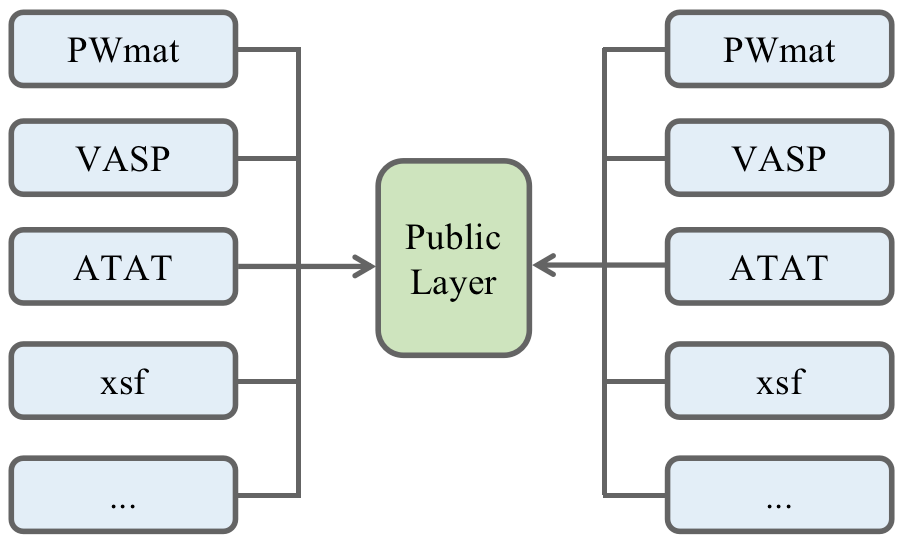
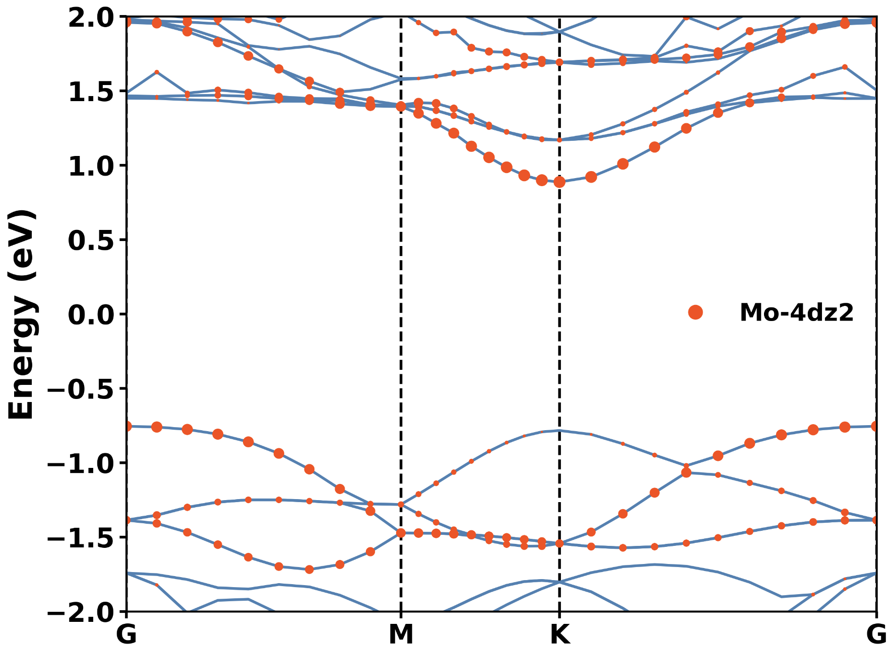
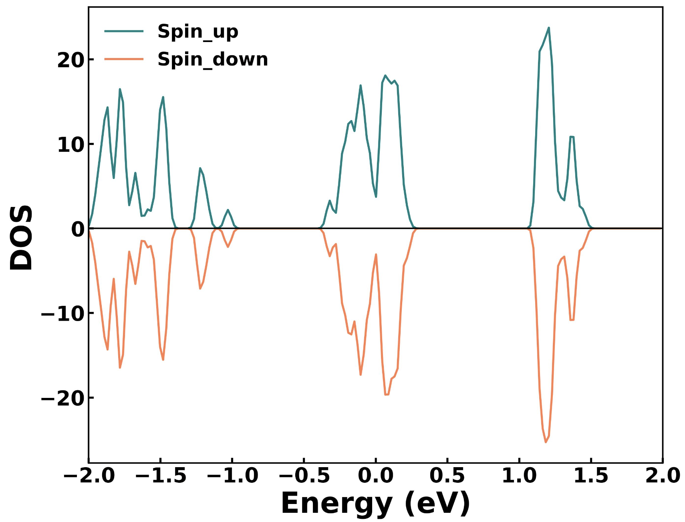
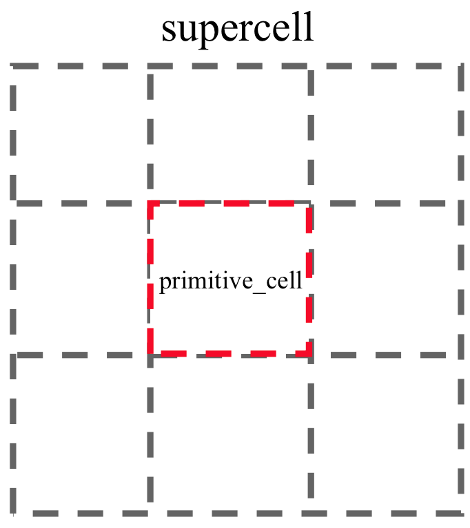

# pflow
A python library for computational materials science. You can use it to:
1. Process structure file (For PWmat, VASP, ATAT, ...)
2. Process Kohn-Sham state (For PWmat, VASP, ...)
3. Process periodic boundary condition

# 1. Brief introduction
## 1.1. Process structure file
You can:
1. Convert file format arbitrarily as below diagram
2. Choose high symmetry for 2D/3D material
3. Choose KMesh
4. ...



## 1.2. Process Kohn-Sham state
1. Support several types of ab initio software, particularlly PWmat.
2. Plot bandstructure, density of state directly.
3. Process something in reciprocal space.
4. ...

       


## 1.3. Process perioidic boundary condination
1. Analyse the local environment for arbitrary crystalline materials, whatever the dimension of material.
2. Generate DEEPMD features conviently. Don't worry about the choice of cutoff radius.
3. You can attach any feature to sites in primitive cell.
4. ...


## 1.4. Pick out specific frame from `MOVEMENT`
### 1.4.1. Extract a `DStructure` object
```python
from pflow.io.pwmat.output.movement import Movement

movement_path = "<your_path>/MOVEMENT"
movement = Movement(movement_path=movement_path)
idx_frame = 400 # 帧数从 0 开始计数

movement.get_frame_structure(idx_frame=idx_frame)
```
Output:
```shell
Full Formula (Li48 Si24)
Reduced Formula: Li2Si
abc   :   8.547883   7.650657  18.529087
angles:  89.343629  88.676291  89.678084
pbc   :       True       True       True
Sites (72)
  #  SP           a         b         c  atomic_energys                               atomic_forces                          atomic_velocitys                         magmom
---  ----  --------  --------  --------  -------------------------------------------  -------------------------------------  -------------------------------------  --------
  0  Li    0.248482  0.166325  0.023068  [-190.9629075   -99.18939963    2.61219776]  [-0.052921   -0.021101   -0.00249793]  [-0.01615606 -0.00884788  0.03065659]         0
  1  Li    0.498616  0.668447  0.021637  [-190.965461    -99.17689351    2.6119282 ]  [-0.04400444  0.04383336 -0.00599634]  [-0.01360629  0.04367014 -0.02783492]         0
  2  Li    0.746912  0.165139  0.021865  [-190.96348605  -99.18914775    2.61217502]  [-0.10646084 -0.09279347 -0.00715677]  [-0.04238363 -0.02334239  0.00495152]         0
  3  Li    0.003076  0.664553  0.023503  [-190.96724419  -99.18476401    2.61349034]  [ 0.09305035 -0.05675996  0.04193563]  [ 0.03363483 -0.03078981  0.03393567]         0
  4  Li    0.248161  0.168193  0.310043  [-190.96966256  -99.19190361    2.61413265]  [-0.08635059  0.09217118 -0.0446559 ]  [-0.03563619  0.01380237 -0.05003397]         0
  5  Li    0.497444  0.664235  0.310627  [-190.96170989  -99.18609189    2.61181192]  [-0.05463873 -0.04676612 -0.01196834]  [-0.0293449  -0.02581651 -0.01754709]         0
  6  Li    0.753284  0.166035  0.309552  [-190.98693027  -99.17790688    2.61618283]  [ 0.1314648  -0.01432219 -0.01233755]  [ 0.03395389 -0.01899584 -0.03792091]         0
  7  Li    0.000786  0.667082  0.309865  [-190.95819955  -99.18635289    2.61193418]  [ 0.02889612  0.00929505 -0.05686133]  [ 0.02359409  0.01203304 -0.04025881]         0
  8  Li    0.249029  0.830648  0.128144  [-191.07056735  -99.14325233    2.64672323]  [-0.01147968  0.01691603  0.01152118]  [-0.01645094 -0.02977361  0.00625589]         0
  9  Li    0.49753   0.329677  0.129352  [-191.06426977  -99.14753488    2.64517545]  [-0.01097156 -0.0014834   0.07430354]  [-0.04640303 -0.04082566  0.04132606]         0
 10  Li    0.752446  0.832934  0.129383  [-191.06412601  -99.14107893    2.64566592]  [0.01386554 0.04942038 0.06570297]     [0.04567186 0.00309484 0.04305812]            0
 11  Li    0.000957  0.334281  0.128594  [-191.07155687  -99.14978223    2.6463258 ]  [0.02699877 0.05162959 0.01555742]     [0.02385995 0.03576984 0.01338908]            0
 12  Li    0.000969  0.000956  0.206398  [-191.08761483  -99.14943479    2.64835669]  [-0.00516641 -0.03230793  0.08359882]  [0.00828921 0.01019295 0.04084199]            0
 13  Li    0.248924  0.497811  0.20613   [-191.06268037  -99.16522218    2.64349575]  [-0.02685562 -0.07631871  0.04630008]  [-0.02058951 -0.02113191  0.02942741]         0
 14  Li    0.501926  0.000378  0.204479  [-191.07073893  -99.14167594    2.64612297]  [ 0.02333715 -0.01424983 -0.06316005]  [ 0.04129869  0.00745725 -0.02342405]         0
 15  Li    0.748261  0.496629  0.204996  [-191.06797     -99.14893423    2.64597476]  [-0.0094361  -0.06411553 -0.02664721]  [-0.04012952 -0.04634727 -0.00010682]         0
 16  Li    0.000386  0.002388  0.354629  [-191.00064268  -99.17364575    2.61788626]  [-0.02095935  0.0777111  -0.06262415]  [-0.00712936  0.04113212 -0.02262241]         0
 17  Li    0.248311  0.497114  0.354295  [-190.96298447  -99.18765721    2.61197501]  [-0.0710748  -0.06857358 -0.04227975]  [-0.02551295 -0.03167827 -0.01615452]         0
 18  Li    0.500762  0.00035   0.356978  [-190.96656281  -99.18004176    2.61317438]  [ 0.0424335  -0.01659782  0.07270997]  [ 0.01890663 -0.00694082  0.03923617]         0
 19  Li    0.748238  0.499825  0.356398  [-190.95465457  -99.19042613    2.61036407]  [-0.04773385 -0.023511    0.06725745]  [-0.02615181 -0.00722567  0.02239703]         0
 20  Li    0.998109  0.999851  0.644908  [-190.97267814  -99.18053747    2.61364915]  [-0.05029192 -0.0090178  -0.01066284]  [-0.01921842 -0.01455411  0.02251638]         0
 21  Li    0.252101  0.501046  0.644331  [-190.96857964  -99.18448726    2.61346265]  [ 0.09662217  0.01956466 -0.03585452]  [ 0.04574882  0.01000114 -0.01376787]         0
 22  Li    0.498407  0.998485  0.64494   [-190.97690842  -99.1744999     2.61422579]  [-0.01163625 -0.00997995  0.00659616]  [-0.048403   -0.01668747  0.03402047]         0
 23  Li    0.748944  0.500729  0.643305  [-190.96896664  -99.18582672    2.61361351]  [-0.02499142  0.02139881 -0.05406638]  [-0.0123377   0.02306928 -0.03585453]         0
 24  Li    0.252347  0.169903  0.462113  [-191.06762572  -99.1443129     2.64697413]  [0.03144414 0.07086526 0.04616725]     [0.02056404 0.04545536 0.01743622]            0
 25  Li    0.503684  0.66383   0.460217  [-191.05742708  -99.1588684     2.64265971]  [ 0.07287048  0.01956383 -0.06014917]  [ 0.03835227 -0.03385346 -0.04975142]         0
 26  Li    0.751852  0.163351  0.459929  [-191.07055082  -99.14985745    2.64514026]  [ 0.01179846  0.01770624 -0.04971565]  [ 0.03521921 -0.04493424 -0.03393623]         0
 27  Li    0.99686   0.668689  0.461788  [-191.04926797  -99.15262033    2.64296366]  [-0.05635005  0.07327444  0.0714647 ]  [-0.04047191  0.02222316  0.02710295]         0
 28  Li    0.250209  0.833469  0.539028  [-191.0526293   -99.14675812    2.6443181 ]  [-0.01497191 -0.04047734  0.00946606]  [ 0.01349292 -0.00264251  0.0059712 ]         0
 29  Li    0.502643  0.334497  0.53828   [-191.05799772  -99.15153228    2.64391791]  [ 0.01057429 -0.02354405 -0.04580813]  [ 0.04540551  0.02519968 -0.01919964]         0
 30  Li    0.751404  0.830435  0.537627  [-191.06438933  -99.15239462    2.64500508]  [ 0.04938514 -0.08118877 -0.05614567]  [ 0.03591997 -0.02623728 -0.03858339]         0
 31  Li    0.00025   0.330182  0.539103  [-191.05855842  -99.14824705    2.64380019]  [ 0.01872542 -0.08468223  0.03411179]  [ 0.01069633 -0.04048977  0.01704277]         0
 32  Li    0.248202  0.830421  0.689951  [-190.97002328  -99.19227571    2.61393011]  [-0.04858884 -0.06118317  0.04025754]  [-0.03556742 -0.05000915  0.04263212]         0
 33  Li    0.50064   0.331939  0.689308  [-190.96088019  -99.18955538    2.61212388]  [ 0.01240784 -0.05678936  0.03174086]  [ 0.00741889 -0.01939062  0.02683163]         0
 34  Li    0.751606  0.832786  0.687912  [-190.97159225  -99.1824811     2.61397507]  [ 0.08119018 -0.03390177 -0.01696943]  [ 0.02350454 -0.00524925 -0.04361968]         0
 35  Li    0.999229  0.33502   0.689687  [-190.9772044   -99.17656995    2.61468721]  [-0.04577468 -0.01463872  0.01909963]  [-0.00729007  0.00773829  0.02697223]         0
 36  Li    0.25108   0.835651  0.977317  [-190.96324612  -99.18840399    2.61228847]  [ 0.04574635  0.10727609 -0.02474345]  [ 0.02098058  0.0399031  -0.02478937]         0
 37  Li    0.497506  0.331142  0.978283  [-190.96413696  -99.18256888    2.61235   ]  [-0.07597884 -0.06093673 -0.01413843]  [-0.03162299 -0.04876678  0.03637198]         0
 38  Li    0.751796  0.836369  0.977652  [-190.95667821  -99.18169827    2.6113577 ]  [ 0.04838999  0.09873501 -0.03899647]  [0.0292335  0.03104703 0.00396365]            0
 39  Li    0.00196   0.333583  0.978977  [-190.97070425  -99.17940766    2.61372497]  [0.09880354 0.04244196 0.01715635]     [ 0.03385243 -0.01152821  0.02729194]         0
 40  Li    0.002144  0.00153   0.79593   [-191.06245909  -99.14265148    2.64594532]  [0.04034119 0.03855461 0.06322137]     [0.03941389 0.03183415 0.04111982]            0
 41  Li    0.251776  0.500808  0.796743  [-191.06766233  -99.1448244     2.64683623]  [0.02655559 0.06592261 0.11932546]     [0.02137193 0.00133652 0.04570185]            0
 42  Li    0.497021  0.001553  0.795194  [-191.06990881  -99.14917938    2.645586  ]  [-0.04771772  0.05403421  0.03286338]  [-0.03047538  0.01082733  0.01801672]         0
 43  Li    0.749632  0.500181  0.796183  [-191.05442562  -99.13948254    2.64474299]  [-0.00505185  0.03702869  0.06609099]  [0.01562324 0.01845792 0.04524118]            0
 44  Li    0.25133   0.165925  0.872832  [-191.07188729  -99.15278869    2.64458284]  [ 0.02391278 -0.05857878  0.02992831]  [ 0.03007142 -0.03151769  0.02392651]         0
 45  Li    0.497891  0.669854  0.87182   [-191.06857714  -99.1508233     2.64589437]  [-0.03462447 -0.014604   -0.03393592]  [-0.02732157  0.03210879 -0.02488309]         0
 46  Li    0.747169  0.164106  0.873379  [-191.07517253  -99.15132292    2.64751323]  [-0.03987436 -0.06809606  0.07762781]  [-0.0389621  -0.03450247  0.03549085]         0
 47  Li    0.002788  0.666731  0.872035  [-191.06359557  -99.14857403    2.64432733]  [ 0.02544751 -0.03187606 -0.02595334]  [0.03889677 0.00884749 0.00870853]            0
 48  Si    0.998947  0.000275  0.060813  [-113.2125258    25.80363898    4.73715642]  [ 0.04692796  0.10024471 -0.23310444]  [-0.01732388  0.00442698 -0.02033027]         0
 49  Si    0.249369  0.499657  0.062731  [-113.2964136    25.76266034    4.75005378]  [-0.02905725  0.11992769  0.14546702]  [-0.00196968 -0.00493067  0.01497447]         0
 50  Si    0.50048   0.999924  0.061453  [-113.2265986    25.82133381    4.74188534]  [ 0.10906489  0.1120595  -0.16807642]  [-0.00796445  0.01102542 -0.02033299]         0
 51  Si    0.74822   0.499622  0.06216   [-113.1218104    25.75847969    4.72804334]  [0.01375488 0.07852232 0.04922405]     [-0.02155053  0.00146364 -0.00700428]         0
 52  Si    0.251121  0.833405  0.270962  [-113.259026     25.73112201    4.74510315]  [-0.02643834 -0.11169794 -0.27991346]  [ 0.01042534  0.01131023 -0.00806238]         0
 53  Si    0.498852  0.333738  0.271301  [-113.3104029    25.74979423    4.75116577]  [-0.10886345 -0.01872396 -0.22845089]  [-0.00359875 -0.00113931  0.00165255]         0
 54  Si    0.750459  0.831793  0.271535  [-113.2164896    25.78650309    4.7396181 ]  [-0.00192356 -0.08695433 -0.0127802 ]  [-0.02403529 -0.02061663 -0.00879479]         0
 55  Si    0.001526  0.334792  0.271488  [-113.3310818    25.84435081    4.75427081]  [ 0.02122929 -0.07212779  0.07068606]  [0.00130324 0.01898551 0.01807328]            0
 56  Si    0.250307  0.831213  0.39609   [-113.1174295    25.69287983    4.72821561]  [0.08340633 0.0528998  0.29908404]     [ 0.01589453 -0.01688149  0.00555299]         0
 57  Si    0.500895  0.332813  0.396097  [-113.2525695    25.75144376    4.74552492]  [0.10524054 0.0762525  0.25742952]     [ 0.02145467 -0.00587257  0.01058705]         0
 58  Si    0.748248  0.831778  0.395034  [-113.2561662    25.80839502    4.74533949]  [-0.06818671  0.03055794  0.0469934 ]  [-0.02407767 -0.01523949 -0.01433779]         0
 59  Si    0.99895   0.335642  0.394652  [-113.1855841    25.80175729    4.73663344]  [ 0.03167253  0.14186245 -0.12999812]  [-0.01462485  0.01048796 -0.01507856]         0
 60  Si    0.248927  0.169063  0.604895  [-113.1603066    25.79256054    4.73305425]  [-0.08460187 -0.01888255 -0.00728953]  [-0.0202627   0.01474899  0.02266188]         0
 61  Si    0.499735  0.666484  0.604509  [-113.261164     25.74703294    4.74498314]  [-0.07079677 -0.11265982 -0.18072993]  [ 0.01064175 -0.00201035 -0.00816234]         0
 62  Si    0.749552  0.167249  0.604394  [-113.1990281    25.74662391    4.73708205]  [-0.0272318  -0.04407041 -0.13631521]  [0.01531912 0.01897006 0.00570899]            0
 63  Si    0.999663  0.667681  0.603418  [-113.2624772    25.71300837    4.74630034]  [-0.09080292 -0.03750573 -0.41251249]  [-0.00855574  0.0142882  -0.0214623 ]         0
 64  Si    0.250759  0.165227  0.728148  [-113.2067039    25.782159      4.73694052]  [ 0.09471321  0.03900966 -0.05375556]  [ 0.01827452 -0.00246374 -0.01723152]         0
 65  Si    0.499826  0.666199  0.729317  [-113.2206371    25.72506839    4.7402788 ]  [0.01926053 0.06598903 0.24878062]     [0.00474583 0.00384804 0.0166891 ]            0
 66  Si    0.749225  0.168187  0.728653  [-113.1723615    25.7397012     4.73378374]  [0.02488088 0.16335823 0.08944703]     [-0.00473091  0.01829237 -0.003644  ]         0
 67  Si    0.998894  0.668357  0.729032  [-113.2598864    25.71138468    4.74534218]  [0.05148315 0.13969753 0.28967089]     [-0.01795994  0.01717464  0.01218907]         0
 68  Si    0.001464  0.998302  0.938165  [-113.2076207    25.8476994     4.74030159]  [-0.02324144 -0.16488437  0.1262279 ]  [ 0.02191343 -0.0149378  -0.00635155]         0
 69  Si    0.250852  0.497381  0.9382    [-113.3050321    25.76583128    4.75168925]  [-0.03212527 -0.18385596 -0.17975025]  [ 0.01881016 -0.02225266 -0.00155407]         0
 70  Si    0.499038  0.000276  0.93858   [-113.33894      25.84771659    4.7545524 ]  [-0.09595045 -0.07156818  0.123389  ]  [-0.00610599  0.01191302  0.01333289]         0
 71  Si    0.751051  0.501891  0.938615  [-113.1331981    25.75245709    4.72798545]  [ 0.00699527 -0.02496774 -0.06700101]  [0.00406131 0.01738578 0.01841762]            0
```

### 1.4.2. Extract virial of specific frame
```python
from pflow.io.pwmat.output.movement import Movement

movement_path = "<your_path>/MOVEMENT"
movement = Movement(movement_path=movement_path)
idx_frame = 100 # 帧数从 0 开始计数

virial_tensor = movement.get_frame_virial(idx_frame=idx_frame)
print(virial_tensor)
```
Output:
```shell
[[ 0.494557  -0.0956012  3.97316  ]
 [-0.0955897 15.6917     4.35965  ]
 [ 3.97358    4.35888   13.3794   ]]
```

### 1.4.3. Extract volume of specific frame
```python
from pflow.io.pwmat.output.movement import Movement

movement_path = "<your_path>/MOVEMENT"
movement = Movement(movement_path=movement_path)
idx_frame = 100 # 帧数从 0 开始计数

volume = movement.get_frame_volume(idx_frame=idx_frame)
print(volume)
```
Output:
```shell
1211.3249341683083
```

### 1.4.4. Extract energy of specific frame
```python
from pflow.io.pwmat.output.movement import Movement

movement_path = "<your_path>/MOVEMENT"
movement = Movement(movement_path=movement_path)
energy_tot, energy_p, energy_k = movement.get_frame_energy(idx_frame=idx_frame)
print( "\t1. Total energy: {0} eV".format(energy_tot) )
print( "\t2. Potential energy: {0} eV".format(energy_p) )
print( "\t3. Kenitic energy: {0} eV".format(energy_k) )
```
Output:
```shell
        1. Total energy: -11867.78458 eV
        2. Potential energy: -11886.338 eV
        3. Kenitic energy: 18.55341566 eV
```

## 1.5. Analyse the neighbors around a center atom
Using following algorithm to handle the periodic boundary conditions (Take an 2D materials as an demo). Our new `expansion function (DStructure.make_supercell_())` requires:
1. The corresponding surfaces of structure to be parallel.
2. The element in `scaling matrix` must be odd number.



```python
from pflow.io.publicLayer.structure import DStructure
from pflow.io.publicLayer.neigh import StructureNeighbors

atom_config_path = "<your_path>/atom.config"
scaling_matrix = [3, 3, 1]  # 取奇数
reformat_mark = True
n_neighbors = 60
algorithm = "ball_tree"
coords_are_cartesian = True

structure = DStructure.from_file(
                      file_format="pwmat", 
                      file_path=file_path)
neighbors = StructureNeighbors(
                      structure=structure,
                      scaling_matrix=scaling_matrix,
                      reformat_mark=reformat_mark,
                      n_neighbors=n_neighbors,
                      algorithm=algorithm)

print()
print("Step 1. primitive_cell 中的原子在 supercell 中对应的index:", end="\t")
print(neighbors._get_key_idxs(scaling_matrix))

print()
print("Step 2. primitive_cell 中原子的近邻原子情况:")
key_nbr_species, key_nbr_distances, key_nbr_coords = \
                       neighbors._get_key_neighs_info(
                               scaling_matrix=scaling_matrix,
                               n_neighbors=n_neighbors,
                               algorithm=algorithm,
                               coords_are_cartesian=coords_are_cartesian)
print("\t2.1. The number of atoms in primitive cell:\t", len(neighbors.structure.species))
print("\t2.2. The shape of key_nbr_species:\t", key_nbr_species.shape)
print("\t2.3. The shape of key_nbr_distances:\t", key_nbr_distances.shape)
print("\t2.4. The shape of key_nbr_coords:\t", key_nbr_coords.shape)
```
Output:
```shell

Step 1. primitive_cell 中的原子在 supercell 中对应的index:      [0, 1, 2, 3, 4, 5, 6, 7, 72, 73, 74, 75]

Step 2. primitive_cell 中原子的近邻原子情况:
        2.1. The number of atoms in primitive cell:      12
        2.2. The shape of key_nbr_species:       (12, 60)
        2.3. The shape of key_nbr_distances:     (12, 60)
        2.4. The shape of key_nbr_coords:        (12, 60, 3)
```

### 1.5.1. Deepmd feature pair (0.25 second per `DStructure`)
```Python
from pflow.io.publicLayer.structure import DStructure
from pflow.io.publicLayer.neigh import StructureNeighbors
from pflow.io.publicLayer.neigh import DpFeaturePair

atom_config_path = "<your_path>/atom.config"
scaling_matrix = [3, 3, 1]
reformat_mark = True
n_neighbors = 60        # 需要设置大一些
algorithm = "ball_tree"
coords_are_cartesian = True

structure = DStructure.from_file(
                file_format="pwmat",
                file_path=atom_config_path)
neighbors = StructureNeighbors(
                structure=structure,
                scaling_matrix=scaling_matrix,
                reformat_mark=reformat_mark,
                n_neighbors=neighbors,
                algorithm=algorithm,
                coords_are_cartesian=coords_are_cartesian)

### Driver code
dp_feature_pair = DpFeaturePair(structure_neighbors=neighbors)

print()
print("Step 1. extract_feature:")
center_atomic_number = 42
nbr_atomic_number = 42
rcut = 3.2
max_num_nbrs = 10   # 需要设置的大一些

dp_feature_pair_an, dp_feature_pair_d, dp_feature_pair_c = \
           dp_feature.extract_feature_pair(
                           center_atomic_number=center_atomic_number,
                           nbr_atomic_number=nbr_atomic_number,
                           rcut=rcut,
                           max_num_nbrs=max_num_nbrs)
print("1.1. Atomic number -- dp_feature_pair_an:")
print(dp_feature_pair_an)
print()
print("1.2. Distance -- dp_feature_pair_d:")
print(dp_feature_pair_d)
print()
print("1.3. Coords -- dp_feature_pair_c:")
print(dp_feature_pair_c)
```
Output:
```shell
Step 1. extract_feature:
1.1. Atomic number -- dp_feature_pair_an:
[[42. 42. 42. 42. 42. 42.  0.  0.  0.  0.]
 [42. 42. 42. 42. 42. 42.  0.  0.  0.  0.]
 [42. 42. 42. 42. 42. 42.  0.  0.  0.  0.]
 [42. 42. 42. 42. 42. 42.  0.  0.  0.  0.]]

1.2. Distance -- dp_feature_pair_d:
[[3.19031539 3.19031539 3.19031539 3.19031539 3.19031556 3.19031556
  0.         0.         0.         0.        ]
 [3.19031539 3.19031539 3.19031539 3.19031539 3.19031556 3.19031556
  0.         0.         0.         0.        ]
 [3.19031539 3.19031539 3.19031539 3.19031539 3.19031556 3.19031556
  0.         0.         0.         0.        ]
 [3.19031539 3.19031539 3.19031539 3.19031539 3.19031556 3.19031556
  0.         0.         0.         0.        ]]

1.3. Coords -- dp_feature_pair_c:
[[[ 3.19031539  0.          0.        ]
  [-3.19031539  0.          0.        ]
  [-1.59515752  2.76289427  0.        ]
  [ 1.59515752 -2.76289427  0.        ]
  [ 1.59515787  2.76289427  0.        ]
  [-1.59515787 -2.76289427  0.        ]
  [ 0.          0.          0.        ]
  [ 0.          0.          0.        ]
  [ 0.          0.          0.        ]
  [ 0.          0.          0.        ]]

 [[-3.19031539  0.          0.        ]
  [ 3.19031539  0.          0.        ]
  [-1.59515752  2.76289427  0.        ]
  [ 1.59515752 -2.76289427  0.        ]
  [ 1.59515787  2.76289427  0.        ]
  [-1.59515787 -2.76289427  0.        ]
  [ 0.          0.          0.        ]
  [ 0.          0.          0.        ]
  [ 0.          0.          0.        ]
  [ 0.          0.          0.        ]]

 [[-3.19031539  0.          0.        ]
  [ 3.19031539  0.          0.        ]
  [ 1.59515752 -2.76289427  0.        ]
  [-1.59515752  2.76289427  0.        ]
  [-1.59515787 -2.76289427  0.        ]
  [ 1.59515787  2.76289427  0.        ]
  [ 0.          0.          0.        ]
  [ 0.          0.          0.        ]
  [ 0.          0.          0.        ]
  [ 0.          0.          0.        ]]

 [[-3.19031539  0.          0.        ]
  [ 3.19031539  0.          0.        ]
  [ 1.59515752 -2.76289427  0.        ]
  [-1.59515752  2.76289427  0.        ]
  [-1.59515787 -2.76289427  0.        ]
  [ 1.59515787  2.76289427  0.        ]
  [ 0.          0.          0.        ]
  [ 0.          0.          0.        ]
  [ 0.          0.          0.        ]
  [ 0.          0.          0.        ]]]
```

### 1.5.2. Embedding of Deepmd feature pair
```python
atom_config_path = "/data/home/liuhanyu/hyliu/code/pflow/demo/structure/atom.config"
scaling_matrix = [3, 3, 1]
reformat_mark = True
n_neighbors = 60    # 需要设置得大一些
algorithm = "ball_tree"
coords_are_cartesian = True

structure = DStructure.from_file(
             file_format="pwmat", 
             file_path=atom_config_path)
neighbors = StructureNeighbors(
             structure=structure,
             scaling_matrix=scaling_matrix,
             reformat_mark=reformat_mark,
             n_neighbors=n_neighbors,
             algorithm=algorithm,
             coords_are_cartesian=coords_are_cartesian)
dp_feature = DpFeaturePair(structure_neighbors=neighbors) 

### Step 2. The embedding of `DpFeaturePair`
print()
print("Step 2. extract feature pair embedding:")
center_atomic_number = 42
nbr_atomic_number = 42
rcut = 3.2
max_num_nbrs = 10   # 需要设置的大一些

dp_feature_pair_embedding = \
         dp_feature.extract_feature_pair_embedding(
                         center_atomic_number=center_atomic_number,
                         nbr_atomic_number=nbr_atomic_number,
                         rcut=rcut,
                         max_num_nbrs=max_num_nbrs)
print(dp_feature_pair_embedding)
```
Output
```shell
Step 2. extract feature pair embedding:
/data/home/liuhanyu/hyliu/code/pflow/pflow/io/publicLayer/neigh.py:615: RuntimeWarning: invalid value encountered in divide
  dp_feature_pair_xyz = dp_feature_pair_c / dp_feature_pair_Rij2
/data/home/liuhanyu/hyliu/code/pflow/pflow/io/publicLayer/neigh.py:623: RuntimeWarning: divide by zero encountered in reciprocal
  dp_feature_pair_Rij_r = np.where(dp_feature_pair_d==0, 0, np.reciprocal(dp_feature_pair_d))
[[[ 0.31344863  0.31344863  0.          0.        ]
  [ 0.31344863 -0.31344863  0.          0.        ]
  [ 0.31344863 -0.1567243   0.27145449  0.        ]
  [ 0.31344863  0.1567243  -0.27145449  0.        ]
  [ 0.31344862  0.15672432  0.27145446  0.        ]
  [ 0.31344862 -0.15672432 -0.27145446  0.        ]
  [ 0.          0.          0.          0.        ]
  [ 0.          0.          0.          0.        ]
  [ 0.          0.          0.          0.        ]
  [ 0.          0.          0.          0.        ]]

 [[ 0.31344863 -0.31344863  0.          0.        ]
  [ 0.31344863  0.31344863  0.          0.        ]
  [ 0.31344863 -0.1567243   0.27145449  0.        ]
  [ 0.31344863  0.1567243  -0.27145449  0.        ]
  [ 0.31344862  0.15672432  0.27145446  0.        ]
  [ 0.31344862 -0.15672432 -0.27145446  0.        ]
  [ 0.          0.          0.          0.        ]
  [ 0.          0.          0.          0.        ]
  [ 0.          0.          0.          0.        ]
  [ 0.          0.          0.          0.        ]]

 [[ 0.31344863 -0.31344863  0.          0.        ]
  [ 0.31344863  0.31344863  0.          0.        ]
  [ 0.31344863  0.1567243  -0.27145449  0.        ]
  [ 0.31344863 -0.1567243   0.27145449  0.        ]
  [ 0.31344862 -0.15672432 -0.27145446  0.        ]
  [ 0.31344862  0.15672432  0.27145446  0.        ]
  [ 0.          0.          0.          0.        ]
  [ 0.          0.          0.          0.        ]
  [ 0.          0.          0.          0.        ]
  [ 0.          0.          0.          0.        ]]

 [[ 0.31344863 -0.31344863  0.          0.        ]
  [ 0.31344863  0.31344863  0.          0.        ]
  [ 0.31344863  0.1567243  -0.27145449  0.        ]
  [ 0.31344863 -0.1567243   0.27145449  0.        ]
  [ 0.31344862 -0.15672432 -0.27145446  0.        ]
  [ 0.31344862  0.15672432  0.27145446  0.        ]
  [ 0.          0.          0.          0.        ]
  [ 0.          0.          0.          0.        ]
  [ 0.          0.          0.          0.        ]
  [ 0.          0.          0.          0.        ]]]
```

## 1.6. Adjacent Matrix
```python
from pflow.io.publicLayer.structure import DStructure
from pflow.io.publicLayer.neigh import AdjacentMatrix


atom_config_path = "<your_path>/atom.config"
scaling_matrix = [3, 3, 3]      # 扩包用于处理周期性边界条件，scaling_matrix需要是奇数
structure = DStructure.from_file(
                   file_format="pwmat",
                   file_path=atom_config_path
                   )
rcut = 3.2      # 截断半径


adjacent_matrix = AdjacentMatrix(
                       structure=structure,
                       rcut=rcut,
                       scaling_matrix=scaling_matrix
                       )
print("The adjacent matrix (radius cutoff = {0}):".forma(rcut))              
print(adjacent_matrix.get_adjacent_matrix())
```
Output:
```shell
The adjacent matrix (radius cutoff = 3.2):
[[0. 1. 1. 1. 0. 0. 1. 1. 1. 1. 0. 0.]
 [1. 0. 1. 1. 1. 0. 0. 1. 0. 0. 1. 0.]
 [1. 1. 0. 1. 0. 1. 0. 0. 1. 0. 0. 1.]
 [1. 1. 1. 0. 1. 1. 0. 0. 0. 1. 1. 1.]
 [0. 1. 0. 1. 0. 1. 0. 0. 0. 0. 1. 0.]
 [0. 0. 1. 1. 1. 0. 0. 0. 0. 0. 0. 1.]
 [1. 0. 0. 0. 0. 0. 0. 1. 1. 1. 0. 0.]
 [1. 1. 0. 0. 0. 0. 1. 0. 1. 1. 1. 0.]
 [1. 0. 1. 0. 0. 0. 1. 1. 0. 1. 0. 1.]
 [1. 0. 0. 1. 0. 0. 1. 1. 1. 0. 1. 1.]
 [0. 1. 0. 1. 1. 0. 0. 1. 0. 1. 0. 1.]
 [0. 0. 1. 1. 0. 1. 0. 0. 1. 1. 1. 0.]]
```


# 2. Installation
## 2.1. Online
```shell
$ git clone git@github.com:LonxunQuantum/pwkit.git
$ cd pflow
$ pip install .
```

## 2.1. Offline
1. You can download a python interpreter containing `pflow` from https://www.jianguoyun.com/p/DfhQFx8Q_qS-CxifgfwEIAA.