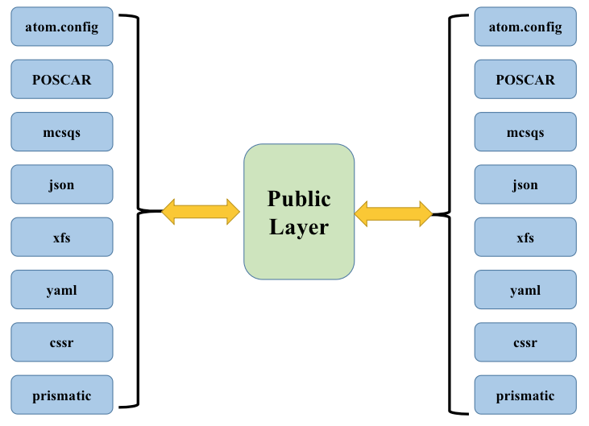

# pflow

A public layer for:
1. "pwmat" ("atom.config")
2. "poscar" ("vasp")
3. "cssr"
4. "json"
5. "xsf"
6. "mcsqs"
7. "prismatic"
8. "yaml"
9. "fleur-inpgen"

# 1. Usage
1. Process structure file in many format (PWmat, VASP, xsf, mcsqs, etc):
   1. Choose KMesh
   2. Choose high symmetry points for 2D/3D materials
   3. Processing reciprocal lattice
   4. ...
2. Process Input/Output files for PWmat
   1. REPORT
   2. DOSTOTAL
   3. IN.KPT
   4. ...